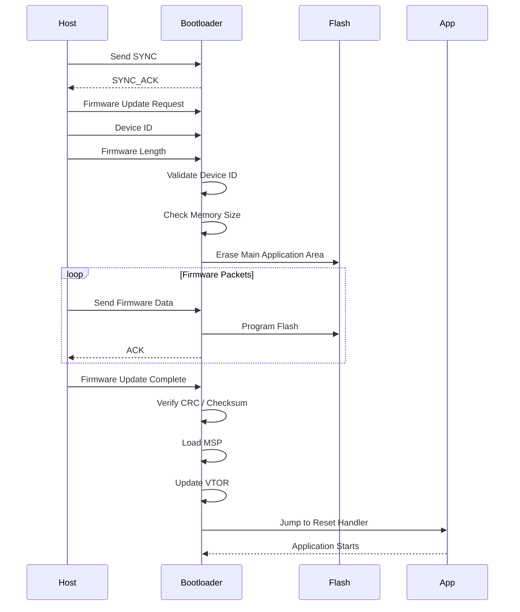

# Bootloaders

**Gaola**
- get firmware split to a bootloader and main application
- Bootloader is compiled independently of main application 

## What is a Bootloader?

- First code that runs in the system after reset
- Stored in **unmodifiable ROM** from the manufacturer,Ensures system reaches a programmable state
- Performs basic initialization and jumps to another program
- May verify firmware before execution
- Responsible for firmware updates (UART, USB, OTA)
  - When bootloader is running, application can be modified

## When is Bootloader Needed?
- Firmware updates (UART, USB, OTA)
- Loading programs from external memory
- Multi-stage boot process
- System recovery or fail-safe mechanisms


---

## Bootloader VS Startup code

| Feature | Bootloader | Startup Code |
|--------|------------|--------------|
| **Definition** | A small program that runs immediately after power-on/reset and loads the main program (firmware/OS) into memory | Low-level initialization code that runs just before `main()` |
| **When it Runs** | After reset, before application | At application start |
| **Purpose** | Load and start the main program | Initialize runtime environment |
| **Primary Role** | Transfers control to application | Prepares system for `main()` execution |
| **Hardware Initialization** | Basic initialization (clock, memory, peripherals) | Application-specific setup |
| **Memory Location** | Separate memory section (often protected ROM/flash) | Part of application binary |
| **Firmware Loading** | Loads firmware from Flash or external storage (SD card, EEPROM, etc.) | No loading functionality |
| **Firmware Update Support** | Yes (UART, USB, OTA) | No |
| **Verification** | May verify firmware integrity before execution | No verification |
| **Stack Initialization** | May or may not | Initializes stack pointer |
| **.data / .bss Initialization** | No | Copies `.data` to RAM and zeroes `.bss` |
| **Interrupt Vector Table** | May set or pass control | Configures it |
| **System Initialization Call** | Minimal setup | Calls `SystemInit()` |
| **Execution Flow** | Hands over control to application | Finally calls `main()` |
| **Language** | C / Assembly | Mostly Assembly (sometimes with C) |
| **Usage Requirement** | Optional (used for updates, external loading, multi-stage boot) | Always required |
| **Examples** | BIOS / UEFI, GRUB, MCU bootloaders | Compiler-generated startup files |

---
 ## Boot Flow and Vector Table (STM32 / MCU)

### Execution from Flash

- The MCU executes code directly from **internal flash memory**
- When the STM32 powers up:
  - It starts execution from a **fixed memory location**
  - The **internal bootloader (ROM)** cannot be modified
- User code (bootloader + application) resides in flash

---
# ARM Cortex-M Boot Process and Interrupt Vector Table

## Interrupt Vector Table (IVT)

- The **Interrupt Vector Table (IVT)** is usually located at the **start of memory** (default flash address).
- It contains **addresses (function pointers)** used by the CPU during reset and interrupt handling.

### Important Entries

### 1. Initial Stack Pointer (MSP)

- Located at **offset 0x00**
- This is **not an interrupt handler**
- Contains the initial value loaded into the **Main Stack Pointer (MSP)**
- Defines where the stack starts

```text
Vector Table Offset 0x00
+-------------------------+
| Initial MSP Value       |
+-------------------------+
```

---

### 2. Reset Vector

- Located at **offset 0x04**
- Contains the address of the **Reset Handler**
- The Reset Handler is the **first code executed after reset**

```text
Vector Table Offset 0x04
+-------------------------+
| Reset Handler Address   |
+-------------------------+
```

---

## Bootloader and Application Memory Layout

Both the bootloader and main application maintain independent sections.

### Bootloader

Contains:

- Its own interrupt vector table
- Code section (.text)
- Data section (.data / .bss)

### Main Application

Contains:

- Separate interrupt vector table
- Application code
- Application data

---

## Boot Flow

```text
MCU Reset
    |
    v
+------------------+
| Bootloader       |
| Executes First   |
+------------------+
         |
         v
Validation / Initialization
(Firmware check, CRC, update check)
         |
         v
Jump to Main Application
```

---

## Memory Layout Example

```text
Flash Memory
+--------------------------------------------------+
| Bootloader Vector Table                          |
+--------------------------------------------------+
| Bootloader Code + Data                           |
+--------------------------------------------------+
| Reserved / Padding                               |
+--------------------------------------------------+
| Application Vector Table                         |
+--------------------------------------------------+
| Application Code + Data                          |
+--------------------------------------------------+
```

### Observation

When using both bootloader and application:

1. Bootloader vector table remains at default address
2. Application vector table exists at another flash offset

Therefore, interrupt handling must be redirected after jumping to the application.

---

## Vector Table Relocation

The MCU must be informed that the application uses a different vector table.

This is done using:

**VTOR (Vector Table Offset Register)**

Example:

```c
SCB->VTOR = APPLICATION_START_ADDRESS;
```

This updates the interrupt vector base address to the application vector table.

---

# Bootloader Responsibilities

The bootloader should:

### 1. Load Application Reset Handler

Read the application's reset vector:

```text
APP_BASE + 0x04
```

Load its address and jump to it.

Example flow:

```c
appStack = *(uint32_t*)APP_BASE;
appReset = *(uint32_t*)(APP_BASE + 4);

__set_MSP(appStack);

jump_to_app = (void (*)(void))appReset;
jump_to_app();
```

---

### 2. Limit Bootloader Size

Prevent linker overflow if bootloader exceeds allowed memory.

Example:

- Bootloader maximum size = 64 KB
- Linker script enforces limit

If exceeded:

```text
Link Error:
Bootloader exceeds allocated region
```

---

### 3. Pad Bootloader Region

Reserve fixed flash area for bootloader.

Example:

```text
0x08000000 - 0x0800FFFF
```

Application starts after reserved area:

```text
APP_START = 0x08010000
```

Unused space is padded.

---

# Main Application Responsibilities

## 1. Relocate Interrupt Vector Table

Application must update VTOR:

```c
SCB->VTOR = APP_START;
```

This ensures interrupts use the application vector table.

---

## 2. Startup and Linker Configuration

Application linker script must place sections after bootloader space.

Example:

```text
Bootloader:
0x08000000 - 0x0800FFFF

Application:
0x08010000 onwards
```

---

## 3. Include Bootloader Image (Optional)

If required:

- Convert bootloader binary into an object file
- Link it into a dedicated section

Example flow:

```text
boot.bin
    |
objcopy conversion
    |
boot.o
    |
Linked into image
```

Used mainly for:

- Factory programming
- Combined firmware images
- OTA packaging

---

# Complete Startup Sequence

```text
MCU Reset
      |
      v
Load MSP from Bootloader IVT
      |
Load Bootloader Reset Handler
      |
Execute Bootloader
      |
Validation / Update Check
      |
Set MSP from Application IVT
      |
Update VTOR
      |
Jump to Application Reset Handler
      |
Application Starts
```

---

